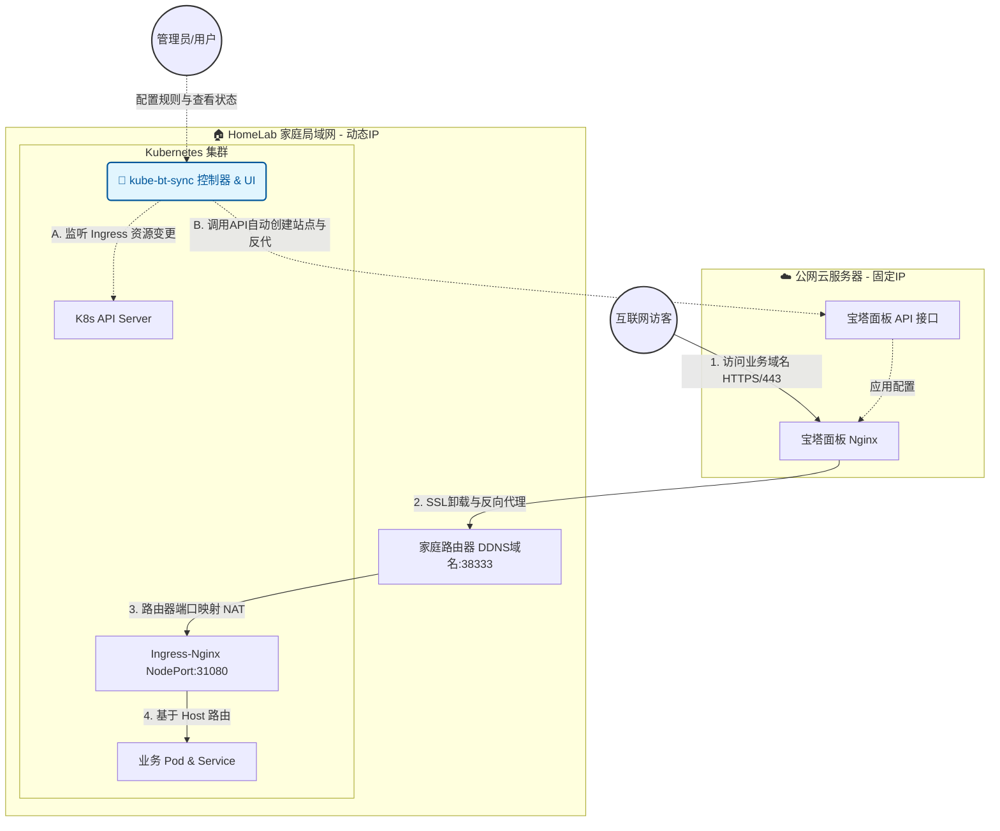

# 🚀 kube-bt-sync (K8s 边缘网关同步中心)


**kube-bt-sync** 是一款专为 HomeLab 玩家和自建 Kubernetes 集群打造的自动化边缘网关同步工具。

它通过监听 K8s 集群中的 Ingress 资源，自动将路由配置同步至云端具备公网 IP 的宝塔面板（Nginx），从而**优雅、无感地解决家庭宽带 80/443 端口被运营商封禁的痛点**。让你彻底告别带端口号的丑陋 URL，实现纯正的公网 Web 访问体验！

---

## 💡 为什么需要它？ (痛点分析)

在国内搭建 HomeLab K8s 集群，通常面临以下困境：
1. **宽带端口封禁**：家庭宽带的公网 IP 必定封禁 `80` 和 `443` 端口，外部访问必须携带尾巴（如 `http://app.i4t.com:38333`）。
2. **割裂的配置体验**：为了去掉端口号，通常需要买一台轻量云服务器做反向代理。但每次在 K8s 里部署新服务，都要**手动去云服务器面板配置一次反代**，极其繁琐，违背了云原生“基础设施即代码 (IaC)”的理念。

**kube-bt-sync 完美解决了这个问题！** 你只需要在 K8s 中像往常一样创建 Ingress，只需加上一个专属 Annotation，剩下的跨网反代配置、域名绑定，全部由它自动完成！

## 🏗️ 架构设计



## ✨ 核心特性

* 🤖 **双向强一致性同步**：监听 K8s Ingress 自动在宝塔建站反代；若在宝塔端误删托管站点，引擎将自动反向清理 K8s 资源，确保两端绝对一致。
* 🩺 **全链路环境探测**：内置强大仪表盘，实时探测宝塔 API 连通性、K8s 底层依赖 (MetalLB/Ingress-Nginx)；甚至包含 **DDNS 解析与 TCP 端口穿透联通性智能探测**。
* 🖱️ **极简级联表单与端口感知**：Web UI 自动抓取 K8s 集群内的 Namespace 与 Service，下拉选择服务后**自动填充业务端口**，彻底告别手动拼写错误。
* 🔐 **HTTPS 智能报警**：一键开启 TLS 结构下发。若探测到宝塔端未申请对应 SSL 证书，大盘将自动爆红警报 ⚠️。
* 🛡️ **轻量级安全认证**：支持基于环境变量的 HTTP Basic Auth 原生拦截，保护 Web 控制台不被未授权访问。
* 🛠️ **表单 / YAML 双模驱动**：支持新手友好的“填表模式”，也集成了极客专属的“YAML 实时编辑模式”。

---

## 🚀 快速开始

### 1. 准备工作
* 一台安装了 **宝塔面板** 的云服务器（拥有固定公网 IP 和 80/443 端口权限）。
* 在宝塔面板的 **面板设置 -> API 接口** 中开启 API，记录下 `API 密钥`，并将你的 K8s 集群出口 IP（或 `0.0.0.0`）加入白名单。
* 一套能够正常运行的 Kubernetes 集群。

### 2. 一键部署 (Helm 方式 - 推荐 🌟)
使用我们提供的 Helm Chart，不仅能部署本工具，还能**全自动为您解决 MetalLB 和 Ingress-Nginx 等底层依赖**。

```bash
# 1. 更新底层组件依赖 (进入 charts/kube-bt-sync 目录)
helm dependency update charts/kube-bt-sync

# 2. 修改 charts/kube-bt-sync/values.yaml 中的宝塔 URL、API Key 和 DDNS 域名配置
# 3. 一键安装并创建命名空间
helm install edge-gateway charts/kube-bt-sync -n tools --create-namespace
```

### 3. 常规部署 (YAML 方式)
如果你喜欢传统的部署方式，请修改项目中 `deploy/deploy.yaml` 的环境变量（`env` 部分）：
```yaml
        env:
        - name: AUTH_USER
          value: "admin"          # Web 仪表盘账号
        - name: AUTH_PASSWORD
          value: "your-password"  # Web 仪表盘密码
        - name: BAOTA_URL
          value: "http://你的云服务器IP:宝塔面板端口"
        - name: BAOTA_API_KEY
          value: "你的宝塔API_KEY"
        - name: DDNS_HOST
          value: "home.i4t.com"   # 你家庭宽带的动态域名
        - name: DEFAULT_PORT
          value: "38333"          # 路由器映射给 K8s Ingress 的入口端口
```
执行部署：`kubectl apply -f deploy/deploy.yaml`

### 4. 访问控制台
部署成功后，通过浏览器访问 K8s 集群任意节点的 NodePort (默认 `31080`) 即可进入可视化仪表盘：
`http://<k8s-node-ip>:31080`

---

## 📖 使用指南

### 方式一：通过 Web UI 发布服务 (推荐)
打开 `kube-bt-sync` 控制台，点击 **“+ 暴露新服务”**。选择你要暴露的 Namespace 和对应的后端 Service，填写业务域名，点击下发即可！引擎将在后台自动完成 K8s Ingress 的创建和云端宝塔反向代理的配置。如需删除，直接在列表点击“移除”即可实现两端级联销毁。

### 方式二：云原生声明式发布 (YAML)
你可以完全忽略 Web UI，继续使用 GitOps 或纯 YAML 管理你的基础设施。只需在标准的 Ingress 配置中加入专属注解：

```yaml
apiVersion: networking.k8s.io/v1
kind: Ingress
metadata:
  name: my-app-ingress
  namespace: default
  annotations:
    # 【核心】打上此标签，控制器才会将其同步至宝塔
    kube-bt-sync.io/baota-sync: "true"         
    # 【可选】覆盖全局默认的 38333 端口，走自定义通道
    kube-bt-sync.io/ddns-port: "48888"         
spec:
  ingressClassName: nginx # 使用官方标准字段指定控制器
  tls:
  - hosts:
    - app.i4t.com         # 如果需要 HTTPS，正常声明 TLS 即可
    secretName: app-tls
  rules:
  - host: app.i4t.com
    http:
      paths:
      - path: /
        pathType: Prefix
        backend:
          service:
            name: my-app-svc
            port:
              number: 80
```
`kube-bt-sync` 会自动捕获到此 YAML 的应用，并将路由秒级同步配置到远端云服务器！

### 方式三：让已有（存量）的 Ingress 接入生效
如果你的集群中已经有配置好的 Ingress 路由，**不需要删除重建**！只需通过命令行给它打上我们的专属注解，引擎就会立刻捕获并将其同步到云端宝塔面板：

```bash
# 1. 为存量 Ingress 开启宝塔同步
kubectl annotate ingress <你的ingress名称> -n <命名空间> kube-bt-sync.io/baota-sync="true"

# 2. (可选) 如果该服务需要使用非全局默认的自定义 DDNS 端口
kubectl annotate ingress <你的ingress名称> -n <命名空间> kube-bt-sync.io/ddns-port="48888"
```
*(打上注解后，刷新 Web 控制台，你就可以在“已托管路由状态”列表中看到它了！)*

---

## ⚙️ 全局环境变量参考

| 变量名 | 必填 | 默认值 | 描述 |
| :--- | :--- | :--- | :--- |
| `AUTH_USER` | 否 | 无 | 仪表盘 Basic Auth 登录账号 (留空则不开启验证) |
| `AUTH_PASSWORD` | 否 | 无 | 仪表盘 Basic Auth 登录密码 |
| `BAOTA_URL` | 是 | 无 | 宝塔面板的完整访问地址 (支持 http/https) |
| `BAOTA_API_KEY` | 是 | 无 | 宝塔面板 API 接口密钥 |
| `DDNS_HOST` | 是 | 无 | 家庭局域网对外暴露的 DDNS 域名 |
| `DEFAULT_PORT` | 否 | `38333` | 路由器向 K8s Ingress 映射的默认公网高端口 |

---

## 🤝 贡献与支持
欢迎提交 Pull Request 或发起 Issue！如果你觉得这个工具让你的 HomeLab 体验变得更好，请给我一个 ⭐ Star！

## 📄 License
MIT License. 自由折腾，探索无限！
