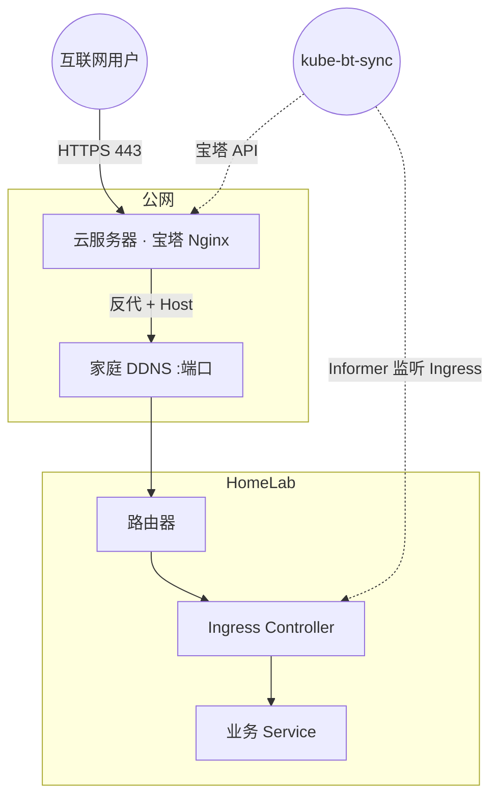

<<<<<<< HEAD
# 🚀 kube-bt-sync (K8s 边缘网关同步中心)


**kube-bt-sync** 是一款专为 HomeLab 和自建 Kubernetes 集群打造的自动化边缘网关同步工具。

它通过监听集群中的 Ingress，自动将路由同步至公网宝塔面板（Nginx），**解决家庭宽带 80/443 被封、需带端口访问**的问题。内置 **React + Vite** Web 控制台，支持 Ingress 管理、集群资源浏览、可选 vCenter 集成等。

---

## 💡 为什么需要它？

1. **宽带端口封禁**：家庭公网常封 `80`/`443`，外网访问需带端口（如 `:38333`）。
2. **配置割裂**：在云主机上手动配反代与 K8s Ingress 不同步，违背 IaC。

**kube-bt-sync** 监听带注解的 Ingress，自动在云服务器 Nginx（宝塔）侧创建站点与反代，与集群声明保持一致。

## 🏗️ 架构设计


```mermaid
graph TD
    User((互联网用户)) -->|HTTPS 443| Baota[云服务器 · 宝塔 Nginx]
    subgraph "公网"
        Baota -->|反代 + Host| DDNS[家庭 DDNS :端口]
    end
    subgraph "HomeLab"
        DDNS --> Router[路由器]
        Router --> Ingress[Ingress Controller]
        Ingress --> Svc[业务 Service]
    end
    Watcher((kube-bt-sync)) -.->|Informer 监听 Ingress| Ingress
    Watcher -.->|宝塔 API| Baota
```

## ✨ 核心特性

- **Ingress 自动同步**：Informer 监听，轮询对齐宝塔站点与反代。
- **Web 控制台**：仪表盘、Ingress、集群工作负载、可选 Prometheus / vCenter。
- **运行时配置**：`data/runtime-config.json`（可挂载 PVC），支持向导 `/setup`。
- **单进程 + 静态前端**：Go 服务默认 `:8080`，同镜像内嵌 `react/dist`。

---

## 🐳 构建镜像

仓库根目录 `Dockerfile` 多阶段构建：Node 构建前端 → Go 编译 → Alpine 运行（非 root 用户 `65532`，健康检查 `GET /api/health`）。

```bash
docker build -t your-registry/kube-bt-sync:latest .
```

多架构示例（需 Docker Buildx）：

```bash
docker buildx build --platform linux/amd64,linux/arm64 -t your-registry/kube-bt-sync:latest --push .
```

---

## ☸️ 部署到 Kubernetes

### 目录说明

| 路径 | 说明 |
|------|------|
| `deploy/` | 原生清单 + `kustomization.yaml` |
| `helm/kube-bt-sync/` | Helm Chart |

### 前置条件

- 集群可调度 Pod，有默认 **StorageClass**（或自行改 PVC / 用 `emptyDir` 开发环境）。
- 应用使用 **in-cluster** `ServiceAccount` 访问 K8s API（清单已含 **ClusterRole**）。
- 宝塔、DDNS 等敏感配置建议放在 **Secret**，通过环境变量注入（见下）。

### 方式一：Kustomize（推荐）

1. 编辑 `deploy/deployment.yaml` 中的镜像地址（将 `ghcr.io/OWNER/kube-bt-sync:latest` 换成你的镜像）。
2. 按需修改 `deploy/pvc.yaml` 的 `storageClassName` / 容量。
3. 应用：

```bash
kubectl apply -k deploy/
```

4. 访问控制台（默认 **ClusterIP**，需自行暴露其一）：

```bash
kubectl -n kube-bt-sync port-forward svc/kube-bt-sync 8080:8080
# 浏览器打开 http://127.0.0.1:8080 ，完成 /setup 或导入配置
```

**可选暴露方式**

- **NodePort**：额外 `kubectl apply -f deploy/service-nodeport.yaml`，用任意节点 IP + `32080`。
- **Ingress**：编辑 `deploy/ingress.yaml` 中的 `host` / `ingressClassName` 后 `kubectl apply -f deploy/ingress.yaml`。

### 方式二：Helm

```bash
helm install kube-bt-sync ./helm/kube-bt-sync \
  --namespace kube-bt-sync --create-namespace \
  --set image.repository=your-registry/kube-bt-sync \
  --set image.tag=latest
```

常用参数（见 `helm/kube-bt-sync/values.yaml`）：

| 参数 | 含义 |
|------|------|
| `service.type` | `ClusterIP` / `NodePort` / `LoadBalancer` |
| `ingress.enabled` | 是否创建 Ingress |
| `persistence.enabled` | 是否使用 PVC 持久化 `KUBEBT_DATA_DIR`（默认 `/data`） |
| `rbac.full` | `true`：完整控制台权限；`false`：仅 Ingress 同步（权限收紧） |

升级：

```bash
helm upgrade kube-bt-sync ./helm/kube-bt-sync -n kube-bt-sync
```

### 数据目录与密钥

- 环境变量 **`KUBEBT_DATA_DIR`**：清单中默认为 **`/data`**，对应 PVC 挂载点；存放 `runtime-config.json`、审计日志等。
- **宝塔 / vCenter / 登录密码**等：建议创建 Secret，在 Deployment 中 `envFrom: secretRef` 引用，勿将密钥写入 Git。

示例 Secret（按需删减）：

```yaml
apiVersion: v1
kind: Secret
metadata:
  name: kube-bt-sync-env
  namespace: kube-bt-sync
type: Opaque
stringData:
  BAOTA_URL: "http://云主机:面板端口"
  BAOTA_API_KEY: "面板API密钥"
  DDNS_HOST: "home.example.com"
  DEFAULT_PORT: "38333"
```

在 `deploy/deployment.yaml` 的 `containers[0]` 下增加：

```yaml
          envFrom:
            - secretRef:
                name: kube-bt-sync-env
```

### RBAC 说明

- **`deploy/rbac.yaml`**：面向**完整 Web 功能**（Ingress、工作负载列表、Pod 日志/终端、YAML 下发等），ClusterRole 包含多组 API 权限。
- 若仅需 **Ingress ↔ 宝塔同步**，可将 Helm `rbac.full` 设为 `false`，或自行删减 `deploy/rbac.yaml` 仅保留 `networking.k8s.io/ingresses`。

### 健康检查与端口

- 探活路径：`GET /api/health`
- 默认监听：环境变量 **`DASHBOARD_HTTP_ADDR`**（默认 `:8080`）。若修改端口，请同步修改 Service `targetPort`、Dockerfile `HEALTHCHECK` 或关闭镜像内健康检查。

---

## 🚀 快速开始（逻辑说明）

1. **宝塔**：开启 API，白名单放行集群出口 IP，记录 `BAOTA_URL`、`BAOTA_API_KEY`。
2. **部署**：按上文将应用部署进集群，**首次**浏览器访问控制台完成 `/setup`，或预先注入 Secret / 环境变量。
3. **Ingress 注解**：在需同步的 Ingress 上添加（键名以你仓库注解为准）：

```yaml
metadata:
  annotations:
    i4t.com/baota-sync: "true"
    # 可选：i4t.com/ddns-port: "48888"
=======
# 🚀 Kube-BT-Sync 边缘网关同步工具


**Kube-BT-Sync** 是一款专为 **HomeLab (家庭数据中心) / 边缘节点** 设计的轻量级云原生网关同步工具。它能够将家庭内网 Kubernetes 集群的服务暴露需求，实时、自动地同步到具有公网 IP 的宝塔 (Baota) 面板上，实现内外网流量的完美穿透与接管。

> **作者：** [abcdocker (i4t.com)](https://i4t.com)

---

## ✨ 核心特性升级

- 🕸️ **云边协同组网**：公网宝塔面板处理 HTTPS 与 WAF 防护，后端流量精准穿透至家庭 K8s 节点。
- 🖥️ **高颜值 Web 控制台**：提供大盘监控，**前端原生支持自定义 HTTPS 端口全链路探活探测**。
- 🖱️ **配置可视化与在线编辑**：
  - **可视化向导**：智能联动获取 Namespace/Service/Port。
  - **在线编辑与查看**：一键提取存量 Ingress 纯净 YAML，支持页面直接修改覆盖。
  - **版本审计**：追踪路由 K8s ResourceVersion 变更记录，精确显示创建时间和修改时间。
- 🔒 **一键原生 SSL/HTTPS 支持**：申请 Ingress 界面提供 SSL 开启开关，自动注入标准 TLS 证书块，无缝对接 Let's Encrypt。
- 📡 **智能雷达探测**：自动识别 `MetalLB` 和 `Ingress-Nginx` 的部署状态（兼容 DaemonSet 裸机模式）。
- 🔄 **事件驱动极速同步**：废弃高频轮询，全面拥抱 K8s Native Watcher (事件驱动)，精准捕捉配置变动，宝塔 API 零压迫。

---

## 🗺️ 架构与流量链路

外网用户访问您的业务域名时，流量流经如下路径：
1. **外网访客** ➜ 访问公网域名 `https://app.i4t.com`
2. **云端宝塔面板** ➜ 接收请求，通过反向代理将流量打向您家庭宽带的 DDNS 地址和高端口 (例: `home.i4t.com:38333`)
3. **家庭主路由器 (NAT)** ➜ 接收到流量，转发至 K8s 物理节点的 `80/443` 端口
4. **K8s Ingress 控制器** ➜ Nginx 接收流量，根据 Ingress 规则路由给具体的业务 Pod

---

## 🚀 快速部署

### 1. 准备工作
- 一台具有公网 IP 并安装了宝塔面板的云服务器。
- 在宝塔面板中开启 API 功能，并将 K8s 所在环境的公网出口 IP 加入白名单。
- 准备好一个家庭宽带的 DDNS 域名（如 `home.i4t.com`）。

### 2. 部署到 Kubernetes (二选一)

本项目支持 **Helm 一键部署 (推荐)** 和 **纯 YAML 部署** 两种方式：

#### 方案 A：使用 Helm 部署 (🔥 推荐)
请进入仓库根目录，修改 `charts/kube-bt-sync/values.yaml` 中的对应变量，然后执行：
```bash
helm install edge-gateway charts/kube-bt-sync -n tools --create-namespace
```

#### 方案 B：使用纯 YAML 部署
直接下载并编辑 `deploy.yaml`，将其中的环境变量替换为您自己的真实信息，然后执行：
```bash
kubectl apply -f deploy.yaml
```

### 3. 访问控制台
部署成功后，通过任意 K8s 节点的局域网 IP 和 `31080` 端口访问 Web 控制台。

---

## 🎯 如何接管与编辑存量 Ingress

如果您在部署 Kube-BT-Sync 之前，集群中已经存在跑着的业务 Ingress，**完全不需要删除重建！**
只需执行以下命令，工具就会瞬间接管并在 UI 面板中展现其创建与修改记录：
```bash
kubectl annotate ingress <你的存量Ingress名称> -n <命名空间> kube-bt-sync.io/baota-sync="true"
```
接入后，您可以直接在 Web 页面点击 **“📝 编辑”**，即可进入 YAML 极客模式安全地修改并覆盖它。

---

## ⚙️ 环境变量配置说明

| 变量名 | 必填 | 说明 | 示例值 |
| :--- | :---: | :--- | :--- |
| `AUTH_USER` | 是 | Web 控制台登录账号 | `admin` |
| `AUTH_PASSWORD` | 是 | Web 控制台登录密码 | `i4t123456` |
| `BAOTA_URL` | 是 | 宝塔面板 API 接口地址 | `http://110.x.x.x:8888` |
| `BAOTA_API_KEY` | 是 | 宝塔面板 API 密钥 | `faEZ...` |
| `DDNS_HOST` | 是 | 家庭宽带绑定的动态域名 | `home.i4t.com` |
| `DEFAULT_PORT`| 是 | 宝塔反代接收默认端口 | `38333` |
| `HTTPS_PORT`| 否 | **(新增)** 自定义外网直连 HTTPS 端口，默认 443 | `44333` |

---

## 🛠️ 路由器 NAT 映射配置 (极度重要)

为保障内外网流量精准穿透以及 HTTPS 证书验证，请在您的主路由器中配置 **两组** 端口映射规则 (指向 K8s 物理节点)：

* **【规则 1 - 宝塔反代专用】**
  * 外部端口：`38333` (对应 `DEFAULT_PORT`) ➜ 内部端口：`80` 
* **【规则 2 - HTTPS 证书签发/直连】**
  * 外部端口：`443` (对应 `HTTPS_PORT` 变量) ➜ 内部端口：`443` (标准 HTTPS 流量与内部组件 ACME 验证必需)

> 💡 **提示**: 登录 Kube-BT-Sync 控制台，首页的“家庭边缘节点”模块会自动探测您的 HTTPS 端口连通状态。

---

## ⚠️ 常见问题避坑指南 (FAQ)

### Q1: 页面访问报 `ERR_TOO_MANY_REDIRECTS` (308 重定向死循环)？
当外网宝塔 Nginx 卸载了 HTTPS 证书，用纯 HTTP 将请求转发给家庭内网的 K8s Ingress 时，由于内网 Ingress 也配置了 TLS，K8s 会默认将 HTTP 请求强制重定向回 HTTPS，导致死循环。

**解决方案：**
Kube-BT-Sync 控制台生成的 Ingress 已默认添加防重定向注解。对于手工编写的 Ingress，请务必加上：
```yaml
annotations:
  nginx.ingress.kubernetes.io/ssl-redirect: "false"
>>>>>>> d16bf5922f8c5e8a4fe187f8af50fc5f2eaa7661
```

---

<<<<<<< HEAD
## ⚙️ 环境变量参考（节选）

| 变量名 | 说明 |
|--------|------|
| `BAOTA_URL` | 宝塔面板地址 |
| `BAOTA_API_KEY` | 宝塔 API 密钥 |
| `DDNS_HOST` | 家庭出口 DDNS 域名 |
| `DEFAULT_PORT` | 映射到 Ingress 的公网端口 |
| `SYNC_INTERVAL_SEC` | 同步轮询间隔（秒） |
| `KUBEBT_DATA_DIR` | 数据目录（K8s 建议 `/data` + PVC） |
| `DASHBOARD_HTTP_ADDR` | 监听地址，默认 `:8080` |
| `DASHBOARD_PASSWORD` | 启用登录时的密码（可选） |

完整列表见 `internal/config.go` 与「账户与平台设置」页面。

---

## 🧪 本地连通性自检

```bash
cp connectivity-check.env.example .env.local
set -a && source .env.local && set +a
go run ./cmd/connectivity-check
```

---

## 🤝 贡献与 License

欢迎 Issue / PR。若对你有帮助，请给个 ⭐。

MIT License.
=======
## 📄 协议

本项目基于 [MIT License](LICENSE) 协议开源。
>>>>>>> d16bf5922f8c5e8a4fe187f8af50fc5f2eaa7661
